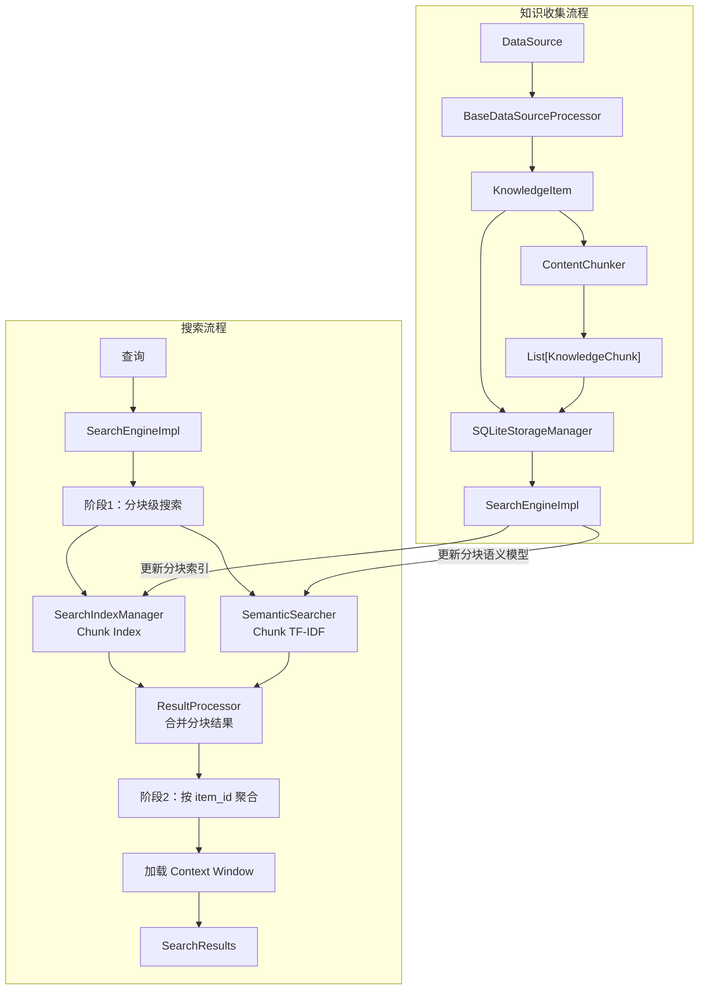
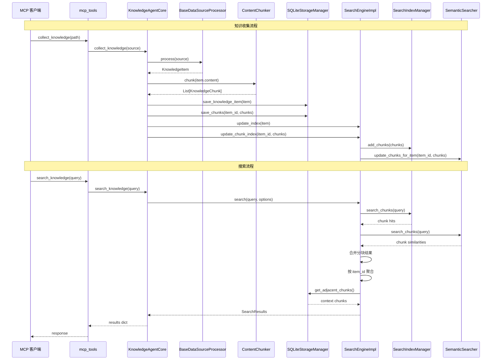
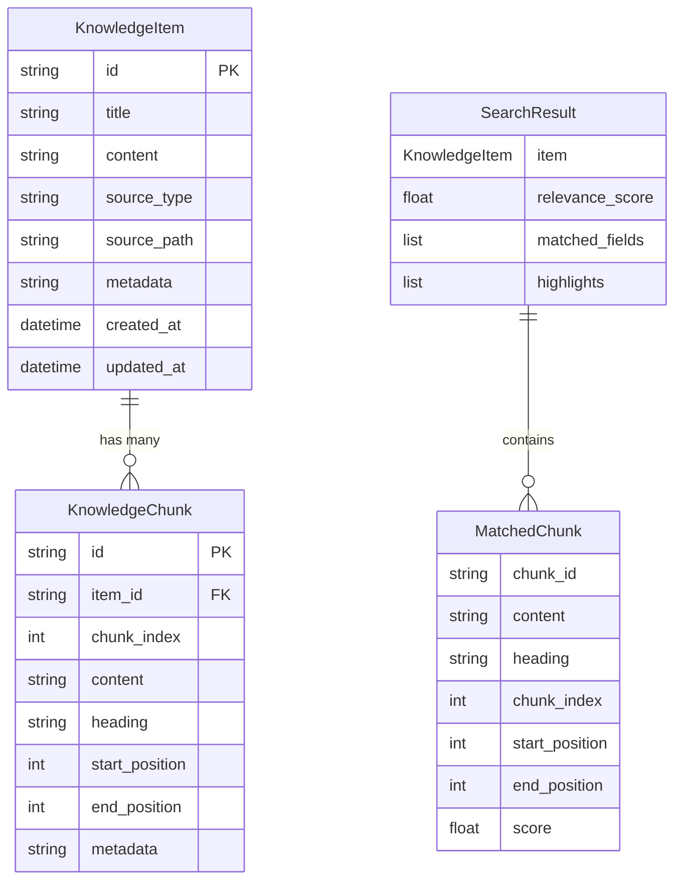

# 设计文档：文档分块与两阶段搜索增强

## 概述

当前系统以 KnowledgeItem（文档级）为最小搜索单元，对长文档的搜索召回率较低。本设计引入文档分块（Chunking）机制，将长文档拆分为语义完整的 KnowledgeChunk，并在分块级别建立 Whoosh 全文索引和 TF-IDF 语义模型，通过两阶段搜索策略（先搜分块、再聚合为文档）显著提升长文档的搜索精度。

核心改动范围：
- 新增 `KnowledgeChunk` 数据模型和 `ContentChunker` 分块引擎
- 扩展 `SQLiteStorageManager` 支持分块的 CRUD
- 扩展 `SearchIndexManager` 和 `SemanticSearcher` 支持分块级索引
- 改造 `SearchEngineImpl` 实现两阶段搜索
- 扩展 `SearchResult` 包含分块级信息
- 集成分块逻辑到 `BaseDataSourceProcessor` 和 `KnowledgeAgentCore`

## 架构

### 整体架构变更

本次改动在现有架构的基础上，沿数据流的两条路径（收集和搜索）分别插入分块逻辑：



### 设计决策

1. **分块索引与文档索引并存**：保留原有的 KnowledgeItem 级索引作为降级方案，新增独立的 KnowledgeChunk 级索引。当分块索引不可用时自动退化为文档级搜索。

2. **ContentChunker 作为独立组件**：分块逻辑封装为独立的 `ContentChunker` 类，不耦合到任何处理器，便于单独测试和复用。

3. **分块在核心层触发**：分块操作在 `KnowledgeAgentCore.collect_knowledge()` 中触发（而非在处理器内部），保持处理器职责单一。

4. **先删后插的分块更新策略**：更新分块时先删除旧分块再插入新分块，避免复杂的差异比对逻辑。


## 组件与接口

### 1. KnowledgeChunk 数据模型

新增文件：`knowledge_agent/models/knowledge_chunk.py`

```python
@dataclass
class KnowledgeChunk:
    id: str                    # 唯一标识，UUID
    item_id: str               # 关联的 KnowledgeItem ID
    chunk_index: int           # 分块在文档中的序号，从 0 开始
    content: str               # 分块文本内容
    heading: str               # 所属标题/章节名，无标题时为空字符串
    start_position: int        # 在原文中的起始字符位置
    end_position: int          # 在原文中的结束字符位置
    metadata: Dict[str, Any]   # 扩展元数据

    def to_dict(self) -> Dict[str, Any]: ...
    @classmethod
    def from_dict(cls, data: Dict[str, Any]) -> "KnowledgeChunk": ...
```

修改文件：`knowledge_agent/models/__init__.py`，导出 `KnowledgeChunk`。

### 2. ContentChunker 分块引擎

新增文件：`knowledge_agent/chunking/content_chunker.py`

```python
@dataclass
class ChunkConfig:
    min_chunk_size: int = 100      # 最小分块大小（字符）
    max_chunk_size: int = 1500     # 最大分块大小（字符）
    overlap_ratio: float = 0.2     # 滑动窗口重叠比例

class ContentChunker:
    def __init__(self, config: Optional[ChunkConfig] = None): ...

    def chunk(self, content: str, title: str = "") -> List[KnowledgeChunk]:
        """
        将文档内容拆分为语义完整的分块。

        三级分块策略：
        1. 按标题/章节结构分块（Markdown # 标题、HTML <h> 标签）
        2. 按段落分块（双换行符分隔）
        3. 对超过 max_chunk_size 的分块使用滑动窗口二次切分

        参数：
            content: 文档文本内容
            title: 文档标题，用于生成 item_id 占位

        返回：
            KnowledgeChunk 列表，chunk_index 从 0 连续递增

        异常处理：
            分块过程中任何异常都会被捕获，退化为单分块返回
        """
        ...

    def _split_by_headings(self, content: str) -> List[Tuple[str, str, int]]:
        """按标题结构分块，返回 (heading, content, start_pos) 列表"""
        ...

    def _split_by_paragraphs(self, content: str, start_offset: int) -> List[Tuple[str, int]]:
        """按段落分块，返回 (paragraph, start_pos) 列表"""
        ...

    def _sliding_window_split(self, text: str, start_offset: int) -> List[Tuple[str, int]]:
        """滑动窗口切分超长文本，返回 (chunk_text, start_pos) 列表"""
        ...
```

新增文件：`knowledge_agent/chunking/__init__.py`，导出 `ContentChunker` 和 `ChunkConfig`。

### 3. SQLiteStorageManager 扩展

修改文件：`knowledge_agent/storage/sqlite_storage.py`

新增数据库表 `knowledge_chunks`（在 `_init_database` 中创建）：

```sql
CREATE TABLE IF NOT EXISTS knowledge_chunks (
    id TEXT PRIMARY KEY,
    item_id TEXT NOT NULL,
    chunk_index INTEGER NOT NULL,
    content TEXT NOT NULL,
    heading TEXT NOT NULL DEFAULT '',
    start_position INTEGER NOT NULL,
    end_position INTEGER NOT NULL,
    metadata TEXT,
    FOREIGN KEY (item_id) REFERENCES knowledge_items (id) ON DELETE CASCADE
);
CREATE INDEX IF NOT EXISTS idx_chunks_item_id ON knowledge_chunks (item_id);
CREATE INDEX IF NOT EXISTS idx_chunks_item_chunk ON knowledge_chunks (item_id, chunk_index);
```

新增方法：

```python
def save_chunks(self, item_id: str, chunks: List[KnowledgeChunk]) -> None:
    """批量保存分块，先删除该 item_id 的旧分块再插入新分块"""
    ...

def get_chunks_for_item(self, item_id: str) -> List[KnowledgeChunk]:
    """按 chunk_index 排序返回指定条目的所有分块"""
    ...

def get_chunk_by_id(self, chunk_id: str) -> Optional[KnowledgeChunk]:
    """根据 chunk_id 查询单个分块"""
    ...

def get_adjacent_chunks(self, item_id: str, chunk_index: int) -> List[KnowledgeChunk]:
    """查询指定分块的前后相邻分块（chunk_index - 1 和 chunk_index + 1）"""
    ...
```

### 4. SearchIndexManager 扩展

修改文件：`knowledge_agent/search/search_index_manager.py`

新增分块索引 Schema 和相关方法：

```python
# 分块索引 Schema
chunk_schema = Schema(
    chunk_id=ID(stored=True, unique=True),
    item_id=ID(stored=True),
    chunk_index=NUMERIC(stored=True),
    heading=TEXT(stored=True, analyzer=analyzer),
    content=TEXT(stored=True, analyzer=analyzer),
)

# 新增方法
def add_chunk(self, chunk: KnowledgeChunk) -> None: ...
def add_chunks(self, chunks: List[KnowledgeChunk]) -> None: ...
def remove_chunks_for_item(self, item_id: str) -> None: ...
def search_chunks(self, query_str: str, limit: int = 50) -> List[dict]: ...
def rebuild_chunk_index(self, chunks: List[KnowledgeChunk]) -> None: ...
def has_chunk_index(self) -> bool: ...
```

分块索引存储在 `{index_dir}/chunks/` 子目录中，与原有文档索引隔离。

### 5. SemanticSearcher 扩展

修改文件：`knowledge_agent/search/semantic_searcher.py`

新增分块级语义搜索能力：

```python
# 新增属性
self.chunk_vectorizer: TfidfVectorizer  # 分块级向量化器
self.chunk_vectors = None               # 分块向量矩阵
self.chunks: List[KnowledgeChunk] = []  # 分块列表
self.is_chunk_fitted: bool = False       # 分块模型是否已拟合

# 新增方法
def fit_chunks(self, chunks: List[KnowledgeChunk]) -> None: ...
def search_chunks(self, query: str, top_k: int = 10, min_similarity: float = 0.05) -> List[Tuple[KnowledgeChunk, float]]: ...
def update_chunks_for_item(self, item_id: str, chunks: List[KnowledgeChunk]) -> None: ...
def remove_chunks_for_item(self, item_id: str) -> None: ...
```

### 6. SearchEngineImpl 两阶段搜索

修改文件：`knowledge_agent/search/search_engine_impl.py`

改造 `search()` 方法实现两阶段搜索：

```python
def search(self, query: str, options: SearchOptions) -> SearchResults:
    # 尝试分块级搜索
    if self._has_chunk_index():
        return self._chunk_search(query, options)
    # 降级为文档级搜索
    return self._item_search(query, options)

def _chunk_search(self, query: str, options: SearchOptions) -> SearchResults:
    """
    两阶段搜索：
    阶段1：在分块索引上执行关键词 + 语义搜索，获取匹配分块
    阶段2：按 item_id 分组，取每组最高分作为文档得分，加载上下文窗口
    """
    ...

def _item_search(self, query: str, options: SearchOptions) -> SearchResults:
    """原有的文档级搜索逻辑（重命名自原 search 方法）"""
    ...

# 新增索引更新方法
def update_chunk_index(self, item_id: str, chunks: List[KnowledgeChunk]) -> None: ...
def remove_chunks_from_index(self, item_id: str) -> None: ...
def rebuild_chunk_index(self, chunks: List[KnowledgeChunk]) -> None: ...
```

### 7. SearchResult 扩展

修改文件：`knowledge_agent/models/search_result.py`

```python
@dataclass
class MatchedChunk:
    """搜索命中的分块信息"""
    chunk_id: str
    content: str
    heading: str
    chunk_index: int
    start_position: int
    end_position: int
    score: float  # 该分块的匹配得分

    def to_dict(self) -> Dict[str, Any]: ...

@dataclass
class SearchResult:
    item: KnowledgeItem
    relevance_score: float
    matched_fields: List[str] = field(default_factory=list)
    highlights: List[str] = field(default_factory=list)
    matched_chunks: List[MatchedChunk] = field(default_factory=list)    # 新增
    context_chunks: List[MatchedChunk] = field(default_factory=list)    # 新增

    def to_dict(self) -> Dict[str, Any]:
        # 扩展序列化，包含 matched_chunks 和 context_chunks
        ...
```

### 8. KnowledgeAgentCore 集成

修改文件：`knowledge_agent/core/knowledge_agent_core.py`

在 `collect_knowledge()` 中集成分块逻辑：

```python
def collect_knowledge(self, source: DataSource) -> KnowledgeItem:
    # ... 现有逻辑 ...
    item = processor.process(source)

    # 新增：对文档内容进行分块
    chunker = ContentChunker()
    chunks = chunker.chunk(item.content, item.title)
    # 设置每个 chunk 的 item_id
    for chunk in chunks:
        chunk.item_id = item.id

    # 保存到存储层
    if self._storage_manager:
        self._storage_manager.save_knowledge_item(item)
        self._storage_manager.save_chunks(item.id, chunks)

    # 更新搜索索引
    if self._search_engine:
        self._search_engine.update_index(item)
        self._search_engine.update_chunk_index(item.id, chunks)

    return item
```

在 `delete_knowledge_item()` 中同步删除分块索引：

```python
def delete_knowledge_item(self, item_id: str) -> bool:
    # ... 现有逻辑 ...
    if self._search_engine:
        self._search_engine.remove_from_index(item_id)
        self._search_engine.remove_chunks_from_index(item_id)
    # 数据库级联删除会自动清理 knowledge_chunks 表
    ...
```

### 9. 组件交互序列图



## 数据模型

### KnowledgeChunk 实体

| 字段 | 类型 | 说明 | 约束 |
|------|------|------|------|
| id | str | 唯一标识 | UUID，主键 |
| item_id | str | 关联的 KnowledgeItem ID | 外键，NOT NULL |
| chunk_index | int | 分块序号 | 从 0 开始连续递增 |
| content | str | 分块文本内容 | NOT NULL，非空字符串 |
| heading | str | 所属标题/章节名 | 默认空字符串 |
| start_position | int | 原文起始字符位置 | >= 0 |
| end_position | int | 原文结束字符位置 | > start_position |
| metadata | Dict[str, Any] | 扩展元数据 | JSON 序列化存储 |

### MatchedChunk 实体

| 字段 | 类型 | 说明 |
|------|------|------|
| chunk_id | str | 分块 ID |
| content | str | 分块文本内容 |
| heading | str | 所属标题 |
| chunk_index | int | 分块序号 |
| start_position | int | 原文起始位置 |
| end_position | int | 原文结束位置 |
| score | float | 匹配得分 |

### 数据库 Schema 变更

新增 `knowledge_chunks` 表：

```sql
CREATE TABLE IF NOT EXISTS knowledge_chunks (
    id TEXT PRIMARY KEY,
    item_id TEXT NOT NULL,
    chunk_index INTEGER NOT NULL,
    content TEXT NOT NULL,
    heading TEXT NOT NULL DEFAULT '',
    start_position INTEGER NOT NULL,
    end_position INTEGER NOT NULL,
    metadata TEXT,
    FOREIGN KEY (item_id) REFERENCES knowledge_items (id) ON DELETE CASCADE
);

CREATE INDEX IF NOT EXISTS idx_chunks_item_id ON knowledge_chunks (item_id);
CREATE INDEX IF NOT EXISTS idx_chunks_item_chunk ON knowledge_chunks (item_id, chunk_index);
```

### 搜索索引 Schema 变更

新增分块级 Whoosh 索引（独立于现有文档索引）：

| 字段 | Whoosh 类型 | 说明 |
|------|------------|------|
| chunk_id | ID(stored, unique) | 分块唯一标识 |
| item_id | ID(stored) | 关联文档 ID |
| chunk_index | NUMERIC(stored) | 分块序号 |
| heading | TEXT(stored, analyzed) | 标题，使用与文档索引相同的分析器 |
| content | TEXT(stored, analyzed) | 分块内容，使用与文档索引相同的分析器 |

### 实体关系图


