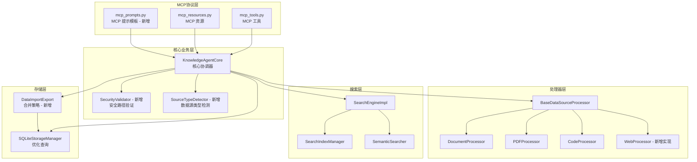

# 设计文档：MCP 综合改进

## 概述

本设计文档描述个人知识管理 MCP 服务器的综合改进方案。改进涵盖三大类：

1. **缺陷修复**：N+1 查询性能问题、内存过滤/统计问题、封装违规、SSE 参数传递、空处理器暴露
2. **功能补全**：数据源类型自动检测、Web 网页处理器、知识条目更新、导入合并策略、安全路径限制、MCP Prompts、删除工具、批量收集、搜索建议
3. **架构增强**：数据库层面过滤分页、公开接口封装、安全验证层

技术栈：Python 3.10+ / FastMCP / SQLite / Whoosh / scikit-learn / pytest

## 架构

### 整体架构

系统采用分层架构，改进后的层次关系如下：



### 改进分类与影响范围

| 改进类别 | 需求编号 | 影响模块 |
|---------|---------|---------|
| 存储层优化 | 1, 2 | sqlite_storage.py, knowledge_agent_core.py |
| 新增组件 | 3, 10 | core/source_type_detector.py, core/security_validator.py |
| 封装修复 | 4 | mcp_resources.py, knowledge_agent_core.py |
| 配置修复 | 5 | knowledge_mcp_server.py |
| 错误处理 | 6 | mcp_tools.py, knowledge_agent_core.py |
| 新增处理器 | 7 | processors/web_processor.py |
| CRUD 补全 | 8, 12 | sqlite_storage.py, mcp_tools.py, knowledge_agent_core.py |
| 导入增强 | 9 | data_import_export.py |
| MCP 扩展 | 11, 13, 14 | server/mcp_prompts.py, mcp_tools.py, search_engine_impl.py |


## 组件与接口

### 1. SQLiteStorageManager 优化（需求 1, 2, 8, 12）

#### 新增/修改方法

```python
class SQLiteStorageManager:
    # 修改：使用 JOIN 查询替代 N+1 查询
    def get_all_knowledge_items(self) -> List[KnowledgeItem]:
        """使用批量 JOIN 查询获取所有知识条目及其分类和标签。"""
        ...

    # 新增：数据库层面过滤和分页
    def query_knowledge_items(
        self,
        category: Optional[str] = None,
        tag: Optional[str] = None,
        limit: int = 50,
        offset: int = 0
    ) -> List[KnowledgeItem]:
        """使用 SQL WHERE/LIMIT/OFFSET 在数据库层面完成过滤和分页。"""
        ...

    # 已有但需确认：数据库统计
    def get_database_stats(self) -> Dict[str, int]:
        """使用 COUNT 聚合查询返回各表记录数量。"""
        ...

    # 新增：部分字段更新
    def update_knowledge_item(
        self,
        item_id: str,
        updates: Dict[str, Any]
    ) -> bool:
        """
        支持部分字段更新，自动更新 updated_at 时间戳。
        
        Args:
            item_id: 知识条目 ID
            updates: 可更新字段字典，支持 title、content、categories、tags
            
        Returns:
            更新成功返回 True，条目不存在返回 False
        """
        ...
```

#### N+1 查询优化策略

当前实现（问题）：
```python
# 当前：对每个 item 执行 2 次额外查询（分类 + 标签）
for row in rows:
    item = self._build_item(row)
    item.categories = self._get_categories_for_item(conn, item.id)  # 查询 N 次
    item.tags = self._get_tags_for_item(conn, item.id)              # 查询 N 次
```

优化方案：使用 3 次查询完成所有数据加载
```python
# 优化后：
# 查询 1：获取所有 knowledge_items
# 查询 2：批量获取所有 item-category 映射（JOIN knowledge_item_categories + categories）
# 查询 3：批量获取所有 item-tag 映射（JOIN knowledge_item_tags + tags）
# 在 Python 中按 item_id 分组组装
```

### 2. SourceTypeDetector（需求 3）

```python
# 新增文件：knowledge_agent/core/source_type_detector.py

class SourceTypeDetector:
    """数据源类型自动检测器。"""

    # 扩展名到类型的映射表
    EXTENSION_MAP: Dict[str, SourceType] = {
        ".pdf": SourceType.PDF,
        ".py": SourceType.CODE,
        ".js": SourceType.CODE,
        ".java": SourceType.CODE,
        ".cpp": SourceType.CODE,
        ".c": SourceType.CODE,
        ".go": SourceType.CODE,
        ".rs": SourceType.CODE,
        ".ts": SourceType.CODE,
        ".jpg": SourceType.IMAGE,
        ".jpeg": SourceType.IMAGE,
        ".png": SourceType.IMAGE,
        ".gif": SourceType.IMAGE,
        ".bmp": SourceType.IMAGE,
        ".webp": SourceType.IMAGE,
        ".txt": SourceType.DOCUMENT,
        ".md": SourceType.DOCUMENT,
        ".doc": SourceType.DOCUMENT,
        ".docx": SourceType.DOCUMENT,
    }

    @staticmethod
    def detect(source_path: str) -> SourceType:
        """
        根据路径自动检测数据源类型。
        
        检测优先级：URL 模式 > 文件扩展名 > 默认 DOCUMENT
        """
        ...
```

### 3. SecurityValidator（需求 10）

```python
# 新增文件：knowledge_agent/core/security_validator.py

class SecurityValidator:
    """安全路径验证器。"""

    def __init__(self, allowed_paths: List[str], blocked_extensions: List[str]):
        ...

    def validate_path(self, file_path: str) -> bool:
        """
        验证文件路径是否安全。
        
        步骤：
        1. 解析为绝对路径（消除 ../ 等遍历序列）
        2. 检查扩展名是否在黑名单中
        3. 如果 allowed_paths 非空，检查路径是否在允许范围内
        """
        ...

    def validate_extension(self, file_path: str) -> bool:
        """检查文件扩展名是否被阻止。"""
        ...
```

### 4. KnowledgeAgentCore 扩展（需求 2, 4, 6, 8, 12, 13）

```python
class KnowledgeAgentCore:
    # 修改：委托给存储层的数据库查询
    def list_knowledge_items(self, **filters) -> List[KnowledgeItem]:
        """使用 Storage_Manager 的 query_knowledge_items 方法。"""
        ...

    # 修改：使用 SQL COUNT 聚合
    def get_statistics(self) -> Dict[str, Any]:
        """使用 get_database_stats() 替代加载全部数据。"""
        ...

    # 修改：对未注册处理器抛出 NotImplementedError
    def _get_processor_for_source(self, source: DataSource) -> DataSourceProcessor:
        """未注册类型抛出描述性 NotImplementedError，而非返回 None。"""
        ...

    # 新增：公开接口（修复封装违规）
    def get_all_categories(self) -> List[Category]:
        """返回所有分类。"""
        ...

    def get_all_tags(self) -> List[Tag]:
        """返回所有标签。"""
        ...

    def get_knowledge_graph(self) -> Dict[str, Any]:
        """返回知识图谱的节点和边数据。"""
        ...

    # 新增：更新知识条目
    def update_knowledge_item(self, item_id: str, updates: Dict[str, Any]) -> bool:
        """更新知识条目并重新索引。"""
        ...

    # 新增：删除知识条目
    def delete_knowledge_item(self, item_id: str) -> bool:
        """删除知识条目及其关联数据和搜索索引。"""
        ...

    # 新增：批量收集
    def batch_collect_knowledge(
        self,
        directory_path: str,
        file_pattern: str = "*",
        recursive: bool = False
    ) -> Dict[str, Any]:
        """遍历目录批量处理文件。"""
        ...
```

### 5. WebProcessor（需求 7）

```python
# 实现文件：knowledge_agent/processors/web_processor.py

class WebProcessor(BaseDataSourceProcessor):
    """网页数据源处理器。"""

    def __init__(self, config: Optional[Dict] = None):
        """
        初始化，读取 web_scraping 配置：
        - timeout: 请求超时（默认 30 秒）
        - max_retries: 最大重试次数
        - user_agent: 请求 User-Agent
        """
        ...

    def _extract_content(self, source: DataSource) -> str:
        """获取网页内容，清除 HTML 标签，保留纯文本。"""
        ...

    def _extract_title(self, html: str) -> str:
        """从 <title> 或 <h1> 标签提取标题。"""
        ...

    def validate(self, source: DataSource) -> bool:
        """验证 URL 格式（http:// 或 https://）。"""
        ...

    def get_supported_types(self) -> list:
        return [SourceType.WEB]
```

设计决策：使用 Python 标准库 `urllib.request` 获取网页，使用 `html.parser` 解析 HTML，避免引入额外依赖（如 requests、beautifulsoup4）。如果项目已有这些依赖则优先使用。

### 6. MCP Prompts（需求 11）

```python
# 新增文件：knowledge_agent/server/mcp_prompts.py

def register_knowledge_prompts(app: FastMCP, knowledge_core) -> None:
    """注册 MCP 提示模板。"""

    @app.prompt()
    def summarize_knowledge(item_id: str) -> str:
        """知识摘要生成提示模板。"""
        ...

    @app.prompt()
    def search_assistant(topic: str) -> str:
        """知识搜索辅助提示模板。"""
        ...

    @app.prompt()
    def organize_suggestions() -> str:
        """知识整理建议提示模板。"""
        ...
```

### 7. MCP Tools 扩展（需求 8, 12, 13, 14）

```python
# 在 mcp_tools.py 中新增注册的工具

@app.tool()
def update_knowledge_item(item_id: str, title: str = "", content: str = "",
                          categories: str = "", tags: str = "") -> Dict[str, Any]:
    """更新知识条目的部分字段。"""
    ...

@app.tool()
def delete_knowledge_item(item_id: str) -> Dict[str, Any]:
    """删除知识条目。"""
    ...

@app.tool()
def batch_collect_knowledge(directory_path: str, file_pattern: str = "*",
                            recursive: bool = False) -> Dict[str, Any]:
    """批量收集目录中的知识。"""
    ...

@app.tool()
def suggest_search(partial_query: str) -> Dict[str, Any]:
    """返回搜索建议列表。"""
    ...
```

### 8. DataImportExport 合并策略（需求 9）

```python
class DataImportExport:
    def import_from_json(
        self,
        data: Dict[str, Any],
        merge_strategy: str = "skip_existing"
    ) -> Dict[str, Any]:
        """
        支持三种合并策略的导入。
        
        Returns:
            导入结果摘要：{
                "new_count": int,
                "skipped_count": int,
                "overwritten_count": int,
                "merged_count": int,
                "error_count": int,
                "errors": List[str]
            }
        """
        ...
```

### 9. MCP Resources 封装修复（需求 4）

```python
# 修改 mcp_resources.py 中的资源函数

# 修改前（封装违规）：
categories = knowledge_core._storage_manager.get_all_categories()

# 修改后（通过公开接口）：
categories = knowledge_core.get_all_categories()
```

### 10. SSE 参数传递修复（需求 5）

```python
class KnowledgeMCPServer:
    def start_sse(self, host: str = "localhost", port: int = 8000,
                  mount_path: str = "/sse") -> None:
        """
        修复：将 host 和 port 参数传递给 FastMCP.run()。
        默认值从配置文件读取。
        """
        self.app.run(
            transport="sse",
            host=host,
            port=port,
            mount_path=mount_path
        )
```

### 11. 搜索建议修复（需求 14）

```python
class SearchEngineImpl:
    def suggest(self, partial_query: str, max_suggestions: int = 10) -> List[str]:
        """
        改进搜索建议实现。
        
        基于 Whoosh 索引的前缀匹配 + 语义搜索器的词项提取，
        返回不超过 max_suggestions 条建议。
        """
        ...
```


## 数据模型

### 现有数据模型（无需修改）

系统已有的核心数据模型保持不变：

- `KnowledgeItem`：知识条目（id, title, content, source_type, source_path, categories, tags, metadata, created_at, updated_at, embedding）
- `Category`：分类（id, name, description, parent_id, confidence）
- `Tag`：标签（id, name, color, usage_count）
- `Relationship`：关系（id, source_id, target_id, relationship_type, strength, description）
- `DataSource`：数据源（path, source_type, metadata, encoding）
- `SourceType`：枚举（DOCUMENT, PDF, WEB, CODE, IMAGE, UNKNOWN）
- `SearchResult`：搜索结果（item, relevance_score, matched_fields, highlights）

### 新增数据结构

#### ImportResult（导入结果摘要）

```python
@dataclass
class ImportResult:
    """导入操作的结果摘要。"""
    new_count: int = 0           # 新增条目数
    skipped_count: int = 0       # 跳过条目数
    overwritten_count: int = 0   # 覆盖条目数
    merged_count: int = 0        # 合并条目数
    error_count: int = 0         # 错误条目数
    errors: List[str] = field(default_factory=list)  # 错误详情列表
```

#### BatchCollectResult（批量收集结果）

```python
@dataclass
class BatchCollectResult:
    """批量知识收集的结果摘要。"""
    success_count: int = 0       # 成功处理数量
    failure_count: int = 0       # 失败处理数量
    failed_files: List[str] = field(default_factory=list)  # 失败文件列表
    errors: List[str] = field(default_factory=list)        # 错误详情
```

### 数据库 Schema（无变更）

现有 SQLite 表结构保持不变：

- `knowledge_items`：主表
- `categories`：分类表
- `tags`：标签表
- `relationships`：关系表
- `knowledge_item_categories`：条目-分类映射表
- `knowledge_item_tags`：条目-标签映射表

改进仅涉及查询方式的优化（JOIN 替代 N+1），不涉及 Schema 变更。


## 正确性属性

*属性是在系统所有有效执行中都应成立的特征或行为——本质上是关于系统应该做什么的形式化陈述。属性是人类可读规范与机器可验证正确性保证之间的桥梁。*

### Property 1: 批量查询与逐条查询等价性

*For any* 知识条目集合，通过 `get_all_knowledge_items()` 批量查询返回的每个 KnowledgeItem 对象（包括其 categories 和 tags），应与通过 `get_knowledge_item(item_id)` 逐条查询返回的对象完全一致。

**Validates: Requirements 1.4**

### Property 2: 分类和标签过滤正确性

*For any* 知识条目集合和任意 category 或 tag 过滤参数，通过 `query_knowledge_items()` 返回的每个条目都应包含指定的分类或标签；且不应遗漏任何符合条件的条目。

**Validates: Requirements 2.1, 2.2**

### Property 3: 分页正确性

*For any* 知识条目集合和任意合法的 limit/offset 参数，`query_knowledge_items()` 返回的结果数量不超过 limit，且返回的条目集合应与全量查询结果按相同排序后取 `[offset:offset+limit]` 切片一致。

**Validates: Requirements 2.3**

### Property 4: 统计数量一致性

*For any* 知识库状态，`get_statistics()` 返回的各类数量（知识条目数、分类数、标签数、关系数）应与实际存储的数据量一致。

**Validates: Requirements 2.4**

### Property 5: 数据源类型检测确定性

*For any* 文件路径字符串，`SourceTypeDetector.detect()` 的结果应满足：已知扩展名映射到对应类型，URL 模式映射到 WEB 类型，未知扩展名默认映射到 DOCUMENT 类型。对同一路径多次调用应返回相同结果。

**Validates: Requirements 3.1, 3.2, 3.3, 3.4, 3.5, 3.6**

### Property 6: 公开接口数据完整性

*For any* 存入存储层的分类和标签集合，通过 `Knowledge_Core.get_all_categories()` 和 `Knowledge_Core.get_all_tags()` 返回的数据应包含所有已存入的分类和标签。

**Validates: Requirements 4.4, 4.5**

### Property 7: 知识图谱节点与边一致性

*For any* 知识库状态，`get_knowledge_graph()` 返回的节点数应等于知识条目数，每条边的 source 和 target 都应对应存在的节点。

**Validates: Requirements 4.6**

### Property 8: 未注册处理器抛出异常

*For any* 未在处理器注册表中注册的 SourceType，调用 `_get_processor_for_source()` 应抛出 `NotImplementedError`，而非返回 None。

**Validates: Requirements 6.3**

### Property 9: HTML 标签清除

*For any* HTML 字符串，经过 `WebProcessor` 的标签清除处理后，结果中不应包含任何 HTML 标签（即不包含 `<...>` 模式的内容）。

**Validates: Requirements 7.2**

### Property 10: HTML 标题提取

*For any* 包含 `<title>` 或 `<h1>` 标签的 HTML 字符串，`WebProcessor._extract_title()` 提取的标题应与标签内的文本内容匹配。

**Validates: Requirements 7.5**

### Property 11: 知识条目部分更新正确性

*For any* 已存在的知识条目和任意合法的更新字段（title、content），更新后重新获取该条目时：被更新的字段应反映新值，未更新的字段应保持不变，且 `updated_at` 时间戳应大于等于更新前的值。

**Validates: Requirements 8.1, 8.2**

### Property 12: 不存在条目的操作安全性

*For any* 不存在于知识库中的 item_id，调用 `update_knowledge_item()` 应返回 False，调用 `delete_knowledge_item()` 应返回 False 或错误响应。

**Validates: Requirements 8.3, 12.3**

### Property 13: skip_existing 策略保持已有数据不变

*For any* 已存在的知识条目集合和导入数据，使用 "skip_existing" 策略导入后，已存在条目的内容、分类和标签应与导入前完全一致。

**Validates: Requirements 9.1**

### Property 14: overwrite 策略覆盖已有数据

*For any* 已存在的知识条目和导入数据中 ID 相同的条目，使用 "overwrite" 策略导入后，该条目的内容应与导入数据一致。

**Validates: Requirements 9.2**

### Property 15: merge 策略分类标签取并集

*For any* 已存在的知识条目和导入数据中 ID 相同的条目，使用 "merge" 策略导入后，该条目的分类集合应为原分类与导入分类的并集，标签集合应为原标签与导入标签的并集。

**Validates: Requirements 9.3**

### Property 16: 导入结果摘要计数不变量

*For any* 导入操作，结果摘要中 `new_count + skipped_count + overwritten_count + merged_count + error_count` 应等于导入数据中的总条目数。

**Validates: Requirements 9.4**

### Property 17: 安全路径验证——允许路径限制

*For any* 非空的 allowed_paths 列表和任意文件路径，如果该路径（解析为绝对路径后）不是 allowed_paths 中任何路径的子路径，则 `SecurityValidator.validate_path()` 应返回 False。

**Validates: Requirements 10.1**

### Property 18: 安全路径验证——扩展名黑名单

*For any* blocked_extensions 列表和任意文件路径，如果该路径的扩展名在 blocked_extensions 中，则 `SecurityValidator.validate_path()` 应返回 False。

**Validates: Requirements 10.2**

### Property 19: 路径遍历规范化

*For any* 包含 `../` 序列的文件路径，`SecurityValidator` 应先将其解析为绝对路径再验证，且验证结果应与直接使用等价绝对路径的验证结果一致。

**Validates: Requirements 10.5**

### Property 20: 提示模板包含输入参数

*For any* 知识条目 ID 和 topic 字符串，调用 `summarize_knowledge(item_id)` 返回的提示应包含该条目的内容，调用 `search_assistant(topic)` 返回的提示应包含该 topic 文本。

**Validates: Requirements 11.2, 11.3**

### Property 21: 删除操作级联清除

*For any* 已存在的知识条目，删除后该条目的关联分类映射、标签映射和关系数据也应被清除，再次获取该条目应返回 None。

**Validates: Requirements 12.2, 12.4**

### Property 22: 批量收集文件匹配与计数不变量

*For any* 目录结构和 file_pattern，批量收集的 `success_count + failure_count` 应等于目录中匹配 pattern 的文件总数。当 `recursive=True` 时应包含子目录中的匹配文件，`recursive=False` 时不应包含。

**Validates: Requirements 13.2, 13.4, 13.6**

### Property 23: 搜索建议数量上限

*For any* 部分搜索词输入，`suggest()` 返回的建议列表长度不超过 10。

**Validates: Requirements 14.2**


## 错误处理

### 错误处理策略

所有自定义异常继承自 `KnowledgeAgentError`（定义在 `knowledge_agent/core/exceptions.py`），异常消息使用英文。

#### 存储层错误

| 场景 | 异常类型 | 处理方式 |
|------|---------|---------|
| 数据库连接失败 | `StorageError` | 记录日志，向上层抛出 |
| 查询执行失败 | `StorageError` | 记录日志，返回空结果或抛出 |
| 更新不存在的条目 | 无异常 | 返回 `False` |
| 删除不存在的条目 | 无异常 | 返回 `False` |

#### 处理器层错误

| 场景 | 异常类型 | 处理方式 |
|------|---------|---------|
| 文件不存在 | `ProcessingError` | 记录日志，向上层抛出 |
| 文件编码错误 | `ProcessingError` | 尝试多种编码，全部失败后抛出 |
| 网页请求超时 | `ProcessingError` | 记录日志，返回超时错误描述 |
| 网页 HTTP 错误 | `ProcessingError` | 记录日志，返回包含状态码的错误描述 |
| 未注册的处理器类型 | `NotImplementedError` | 包含类型名称的描述性消息 |

#### 安全验证错误

| 场景 | 异常类型 | 处理方式 |
|------|---------|---------|
| 路径不在允许范围内 | `ValidationError` | 返回安全限制错误描述 |
| 扩展名被阻止 | `ValidationError` | 返回安全限制错误描述 |
| 路径遍历检测 | 无异常 | 规范化路径后正常验证 |

#### MCP 工具层错误

| 场景 | 处理方式 |
|------|---------|
| 参数验证失败 | 返回 `_format_error_response()` |
| 功能未实现 | 返回 `{"status": "not_implemented", "message": ...}` |
| 业务逻辑错误 | 捕获 `KnowledgeAgentError`，返回格式化错误 |
| 未预期异常 | 捕获 `Exception`，记录日志，返回通用错误 |

#### 导入错误恢复

- 单条目导入失败时，记录错误到 `ImportResult.errors` 列表
- 继续处理剩余条目，不中断整个导入流程
- 最终返回包含成功/失败计数的完整摘要

#### 批量收集错误恢复

- 单文件处理失败时，记录到 `BatchCollectResult.failed_files`
- 继续处理剩余文件
- 最终返回包含成功/失败计数和失败文件列表的摘要

## 测试策略

### 测试框架与工具

- **单元测试框架**：pytest
- **属性测试库**：Hypothesis（Python 属性测试标准库）
- **配置**：每个属性测试最少运行 100 次迭代
- **测试文件位置**：`knowledge_agent/tests/`

### 单元测试覆盖

单元测试聚焦于具体示例、边界条件和集成点：

| 测试文件 | 覆盖范围 |
|---------|---------|
| `test_sqlite_storage.py` | N+1 查询修复验证、query_knowledge_items、update/delete 操作 |
| `test_source_type_detector.py` | 各扩展名映射、URL 检测、默认类型 |
| `test_security_validator.py` | 路径验证、扩展名黑名单、路径遍历、空 allowed_paths |
| `test_web_processor.py` | HTTP 请求 mock、HTML 解析、超时处理、错误状态码 |
| `test_knowledge_agent_core.py` | 公开接口、统计、未注册处理器异常 |
| `test_mcp_tools.py` | 新增工具注册、参数验证、错误响应格式 |
| `test_mcp_resources.py` | 封装修复验证（不再访问私有属性） |
| `test_mcp_prompts.py` | 提示模板注册、参数传递 |
| `test_data_import_export.py` | 三种合并策略、错误恢复、结果摘要 |
| `test_mcp_server.py` | SSE 参数传递、默认值 |
| `test_search_engine.py` | 搜索建议、建议数量上限 |

### 属性测试覆盖

每个属性测试对应设计文档中的一个正确性属性，使用 Hypothesis 生成随机输入：

| 属性编号 | 测试标签 | 生成器策略 |
|---------|---------|-----------|
| Property 1 | Feature: mcp-comprehensive-improvement, Property 1: 批量查询与逐条查询等价性 | 生成随机 KnowledgeItem 集合（含随机分类和标签） |
| Property 2 | Feature: mcp-comprehensive-improvement, Property 2: 分类和标签过滤正确性 | 生成随机条目集合 + 随机过滤参数 |
| Property 3 | Feature: mcp-comprehensive-improvement, Property 3: 分页正确性 | 生成随机条目集合 + 随机 limit/offset |
| Property 4 | Feature: mcp-comprehensive-improvement, Property 4: 统计数量一致性 | 生成随机条目/分类/标签集合 |
| Property 5 | Feature: mcp-comprehensive-improvement, Property 5: 数据源类型检测确定性 | 生成随机文件路径（含各种扩展名和 URL） |
| Property 6 | Feature: mcp-comprehensive-improvement, Property 6: 公开接口数据完整性 | 生成随机分类和标签集合 |
| Property 7 | Feature: mcp-comprehensive-improvement, Property 7: 知识图谱节点与边一致性 | 生成随机条目和关系集合 |
| Property 8 | Feature: mcp-comprehensive-improvement, Property 8: 未注册处理器抛出异常 | 生成随机 SourceType（排除已注册类型） |
| Property 9 | Feature: mcp-comprehensive-improvement, Property 9: HTML 标签清除 | 生成随机 HTML 字符串 |
| Property 10 | Feature: mcp-comprehensive-improvement, Property 10: HTML 标题提取 | 生成包含随机标题的 HTML |
| Property 11 | Feature: mcp-comprehensive-improvement, Property 11: 知识条目部分更新正确性 | 生成随机条目 + 随机更新字段 |
| Property 12 | Feature: mcp-comprehensive-improvement, Property 12: 不存在条目的操作安全性 | 生成随机 UUID |
| Property 13 | Feature: mcp-comprehensive-improvement, Property 13: skip_existing 策略保持已有数据不变 | 生成随机已有条目 + 随机导入数据 |
| Property 14 | Feature: mcp-comprehensive-improvement, Property 14: overwrite 策略覆盖已有数据 | 同上 |
| Property 15 | Feature: mcp-comprehensive-improvement, Property 15: merge 策略分类标签取并集 | 同上 |
| Property 16 | Feature: mcp-comprehensive-improvement, Property 16: 导入结果摘要计数不变量 | 生成随机导入数据（含部分无效条目） |
| Property 17 | Feature: mcp-comprehensive-improvement, Property 17: 安全路径验证——允许路径限制 | 生成随机 allowed_paths + 随机文件路径 |
| Property 18 | Feature: mcp-comprehensive-improvement, Property 18: 安全路径验证——扩展名黑名单 | 生成随机 blocked_extensions + 随机文件路径 |
| Property 19 | Feature: mcp-comprehensive-improvement, Property 19: 路径遍历规范化 | 生成包含 ../ 的随机路径 |
| Property 20 | Feature: mcp-comprehensive-improvement, Property 20: 提示模板包含输入参数 | 生成随机 item_id 和 topic 字符串 |
| Property 21 | Feature: mcp-comprehensive-improvement, Property 21: 删除操作级联清除 | 生成随机条目（含分类、标签、关系） |
| Property 22 | Feature: mcp-comprehensive-improvement, Property 22: 批量收集文件匹配与计数不变量 | 生成随机目录结构（使用临时目录） |
| Property 23 | Feature: mcp-comprehensive-improvement, Property 23: 搜索建议数量上限 | 生成随机部分搜索词 |

### 测试配置

```ini
# pytest.ini 追加配置
[pytest]
markers =
    property: 属性测试标记
    unit: 单元测试标记
```

```python
# conftest.py 中的 Hypothesis 配置
from hypothesis import settings

settings.register_profile("ci", max_examples=100)
settings.register_profile("dev", max_examples=50)
settings.load_profile("ci")
```

### 测试优先级

1. **高优先级**：存储层优化（Property 1-4）、安全验证（Property 17-19）、删除级联（Property 21）
2. **中优先级**：类型检测（Property 5）、更新操作（Property 11-12）、导入策略（Property 13-16）
3. **低优先级**：提示模板（Property 20）、搜索建议（Property 23）、HTML 处理（Property 9-10）
