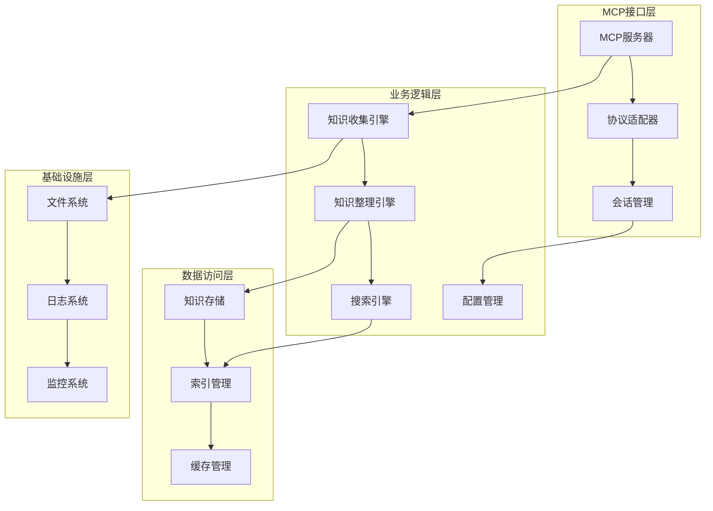

# 设计文档

## 概述

个性化知识管理智能体是一个基于MCP协议的智能知识管理系统，采用模块化架构设计，支持多种数据源的知识收集、智能化知识整理和语义搜索功能。系统设计注重扩展性、性能和用户体验，为用户提供完整的个人知识管理解决方案。

## 架构

系统采用分层架构模式，包含以下主要层次：

### 1. MCP接口层
- **MCP服务器**: 实现标准MCP协议，提供工具和资源接口
- **协议适配器**: 处理MCP消息格式转换和验证
- **会话管理**: 管理客户端连接和会话状态

### 2. 业务逻辑层
- **知识收集引擎**: 处理多种数据源的内容提取和解析
- **知识整理引擎**: 实现自动分类、标签化和关联分析
- **搜索引擎**: 提供语义搜索和自然语言查询功能
- **配置管理**: 处理系统配置和用户偏好设置

### 3. 数据访问层
- **知识存储**: 管理知识条目的持久化存储
- **索引管理**: 维护搜索索引和元数据
- **缓存管理**: 提供高性能的数据访问缓存

### 4. 基础设施层
- **文件系统**: 处理文件存储和管理
- **日志系统**: 记录系统运行日志和用户操作
- **监控系统**: 监控系统性能和健康状态



## 组件和接口

### 知识收集引擎

**核心组件:**
- `DocumentProcessor`: 处理文档文件（Word, TXT, Markdown等）
- `WebScraper`: 抓取和解析网页内容
- `CodeAnalyzer`: 分析代码文件结构和注释
- `ImageProcessor`: 处理图片内容识别和描述生成
- `PDFExtractor`: 提取PDF文本和结构化信息

**接口定义:**
```python
class DataSourceProcessor:
    def process(self, source: DataSource) -> KnowledgeItem:
        """处理数据源并生成知识条目"""
        pass
    
    def validate(self, source: DataSource) -> bool:
        """验证数据源格式和可用性"""
        pass
    
    def get_metadata(self, source: DataSource) -> Dict:
        """提取数据源元数据"""
        pass
```

### 知识整理引擎

**核心组件:**
- `AutoClassifier`: 基于内容的自动分类器
- `TagGenerator`: 智能标签生成器
- `RelationshipAnalyzer`: 知识关联关系分析器
- `KnowledgeGraph`: 知识图谱管理器

**接口定义:**
```python
class KnowledgeOrganizer:
    def classify(self, item: KnowledgeItem) -> List[Category]:
        """自动分类知识条目"""
        pass
    
    def generate_tags(self, item: KnowledgeItem) -> List[Tag]:
        """生成相关标签"""
        pass
    
    def find_relationships(self, item: KnowledgeItem) -> List[Relationship]:
        """发现与其他知识条目的关联关系"""
        pass
```

### 搜索引擎

**核心组件:**
- `SemanticSearcher`: 语义搜索实现
- `QueryProcessor`: 自然语言查询处理器
- `ResultRanker`: 搜索结果排序器
- `SearchIndexer`: 搜索索引构建器

**接口定义:**
```python
class SearchEngine:
    def search(self, query: str, options: SearchOptions) -> SearchResults:
        """执行搜索查询"""
        pass
    
    def suggest(self, partial_query: str) -> List[str]:
        """提供查询建议"""
        pass
    
    def update_index(self, item: KnowledgeItem) -> None:
        """更新搜索索引"""
        pass
```

## 数据模型

### 知识条目模型
```python
@dataclass
class KnowledgeItem:
    id: str
    title: str
    content: str
    source_type: SourceType
    source_path: str
    categories: List[Category]
    tags: List[Tag]
    metadata: Dict[str, Any]
    created_at: datetime
    updated_at: datetime
    embedding: Optional[List[float]]
```

### 分类模型
```python
@dataclass
class Category:
    id: str
    name: str
    description: str
    parent_id: Optional[str]
    confidence: float
```

### 标签模型
```python
@dataclass
class Tag:
    id: str
    name: str
    color: str
    usage_count: int
```

### 关联关系模型
```python
@dataclass
class Relationship:
    source_id: str
    target_id: str
    relationship_type: RelationshipType
    strength: float
    description: str
```

### 搜索结果模型
```python
@dataclass
class SearchResult:
    item: KnowledgeItem
    relevance_score: float
    matched_fields: List[str]
    highlights: List[str]
```

## 正确性属性

*属性是一个特征或行为，应该在系统的所有有效执行中保持为真——本质上是关于系统应该做什么的正式声明。属性作为人类可读规范和机器可验证正确性保证之间的桥梁。*

基于对验收标准的分析，以下是系统必须满足的正确性属性：

### 知识收集属性

**属性 1: 文档处理一致性**
*对于任何*有效的文档文件，当系统处理该文件时，应该创建一个包含文档内容的知识条目
**验证需求: Requirements 1.1**

**属性 2: 网页内容提取**
*对于任何*可访问的网页URL，当系统抓取该URL时，应该提取并存储网页的关键信息
**验证需求: Requirements 1.2**

**属性 3: 代码分析完整性**
*对于任何*代码文件，当系统分析该文件时，应该识别代码结构和注释并生成相应的知识条目
**验证需求: Requirements 1.3**

**属性 4: 图片内容识别**
*对于任何*图片文件，当系统处理该文件时，应该生成描述图片内容的知识条目
**验证需求: Requirements 1.4**

**属性 5: PDF文本提取**
*对于任何*PDF文件，当系统处理该文件时，应该提取其中的文本和结构化信息
**验证需求: Requirements 1.5**

**属性 6: 错误处理一致性**
*对于任何*不支持的数据源格式，系统应该返回明确的错误信息和替代建议
**验证需求: Requirements 1.6**

**属性 7: 系统稳定性保证**
*对于任何*收集过程中的错误，系统应该记录错误详情并保持稳定运行
**验证需求: Requirements 1.7**

### 知识整理属性

**属性 8: 自动分类一致性**
*对于任何*新添加的知识条目，自动分类器应该分析内容并分配适当的分类
**验证需求: Requirements 2.1**

**属性 9: 标签生成完整性**
*对于任何*被分类的知识条目，标签系统应该自动生成相关标签
**验证需求: Requirements 2.2**

**属性 10: 关联关系识别**
*对于任何*具有相似内容的知识条目集合，系统应该识别并建立它们之间的关联关系
**验证需求: Requirements 2.3**

**属性 11: 学习能力保证**
*对于任何*用户手动调整的分类或标签，系统应该学习用户偏好并优化后续自动分类
**验证需求: Requirements 2.4**

**属性 12: 性能优化触发**
*对于任何*超过阈值的知识条目数量，系统应该自动重新组织知识结构以保持性能
**验证需求: Requirements 2.5**

**属性 13: 知识图谱更新**
*对于任何*建立的关联关系，知识图谱应该更新以反映新的连接
**验证需求: Requirements 2.6**

**属性 14: 冲突解决机制**
*对于任何*分类冲突情况，系统应该提供解决建议并允许用户选择
**验证需求: Requirements 2.7**

### 智能搜索属性

**属性 15: 语义搜索准确性**
*对于任何*自然语言查询，语义搜索应该理解查询意图并返回相关的知识条目
**验证需求: Requirements 3.1**

**属性 16: 双重匹配机制**
*对于任何*关键词搜索，系统应该同时进行精确匹配和语义匹配
**验证需求: Requirements 3.2**

**属性 17: 结果排序和筛选**
*对于任何*产生大量结果的搜索查询，系统应该按相关性排序并提供筛选选项
**验证需求: Requirements 3.3**

**属性 18: 跨领域结果分组**
*对于任何*涉及多个知识领域的搜索，系统应该按领域分组显示结果
**验证需求: Requirements 3.6**

**属性 19: 查询历史记录**
*对于任何*搜索操作，系统应该记录查询历史以改进后续搜索
**验证需求: Requirements 3.7**

### MCP协议属性

**属性 20: API响应标准化**
*对于任何*外部系统的知识服务请求，MCP服务器应该提供标准化的API响应
**验证需求: Requirements 4.2**

**属性 21: 请求格式验证**
*对于任何*接收到的MCP请求，系统应该验证请求格式并处理有效请求
**验证需求: Requirements 4.4**

**属性 22: 并发请求处理**
*对于任何*多个客户端的同时连接，MCP服务器应该正确处理并发请求
**验证需求: Requirements 4.6**

### 数据持久化属性

**属性 23: 数据持久化即时性**
*对于任何*知识条目的创建或修改，系统应该立即持久化到本地存储
**验证需求: Requirements 5.1**

**属性 24: 数据导出标准化**
*对于任何*数据导出请求，系统应该提供标准格式的数据导出功能
**验证需求: Requirements 5.2**

**属性 25: 数据导入完整性**
*对于任何*数据导入操作，系统应该验证数据完整性并安全导入
**验证需求: Requirements 5.3**

**属性 26: 权限验证一致性**
*对于任何*敏感数据访问，系统应该验证用户权限
**验证需求: Requirements 5.4**

### 扩展性属性

**属性 27: 配置规则生效**
*对于任何*自定义分类规则的设置，系统应该使配置生效并影响后续分类行为
**验证需求: Requirements 6.2**

**属性 28: 算法参数调整**
*对于任何*用户偏好的变化，系统应该允许调整搜索和分类算法参数
**验证需求: Requirements 6.4**

### 用户交互属性

**属性 29: 操作反馈及时性**
*对于任何*知识管理操作，系统应该提供实时反馈和进度信息
**验证需求: Requirements 7.2**

**属性 30: 错误信息友好性**
*对于任何*操作失败，系统应该显示用户友好的错误信息和解决建议
**验证需求: Requirements 7.3**

**属性 31: 批量操作控制**
*对于任何*批量操作，系统应该显示进度条和允许取消操作
**验证需求: Requirements 7.5**

**属性 32: 状态信息同步**
*对于任何*系统状态改变，系统应该及时更新状态信息
**验证需求: Requirements 7.6**

**属性 33: 内容展示结构化**
*对于任何*知识条目的查看，系统应该以结构化和易读的格式展示内容
**验证需求: Requirements 7.7**

<function_calls>
<invoke name="prework">
<parameter name="featureName">personal-knowledge-agent

## 错误处理

### 错误分类

**1. 数据源错误**
- 文件格式不支持
- 文件损坏或无法读取
- 网络连接失败
- 权限不足

**2. 处理错误**
- 内容解析失败
- 分类算法错误
- 索引构建失败
- 存储空间不足

**3. 搜索错误**
- 查询语法错误
- 索引损坏
- 超时错误
- 结果集过大

**4. 系统错误**
- MCP协议错误
- 配置文件错误
- 依赖服务不可用
- 内存不足

### 错误处理策略

**优雅降级**: 当某个功能模块出现错误时，系统应该继续提供其他功能
**错误恢复**: 实现自动重试机制和数据恢复功能
**用户通知**: 提供清晰的错误信息和解决建议
**日志记录**: 详细记录错误信息用于调试和监控

### 错误响应格式

```python
@dataclass
class ErrorResponse:
    error_code: str
    error_message: str
    error_details: Dict[str, Any]
    suggested_actions: List[str]
    timestamp: datetime
```

## 测试策略

### 双重测试方法

系统采用单元测试和基于属性的测试相结合的方法：

**单元测试**:
- 验证特定示例和边缘情况
- 测试组件间的集成点
- 验证错误条件处理
- 测试具体的业务逻辑

**基于属性的测试**:
- 验证跨所有输入的通用属性
- 通过随机化提供全面的输入覆盖
- 测试系统的正确性保证
- 发现边缘情况和意外行为

### 测试配置

**属性测试配置**:
- 每个属性测试最少运行100次迭代
- 每个属性测试必须引用其设计文档属性
- 标签格式: **Feature: personal-knowledge-agent, Property {number}: {property_text}**

**测试框架选择**:
- **Python**: 使用Hypothesis进行基于属性的测试
- **单元测试**: 使用pytest框架
- **集成测试**: 使用pytest-asyncio进行异步测试

### 测试数据生成

**智能生成器**:
- 文档生成器: 生成各种格式的测试文档
- 代码生成器: 生成不同语言的代码片段
- 查询生成器: 生成自然语言查询和关键词
- 知识条目生成器: 生成具有不同特征的知识条目

**约束条件**:
- 生成器应该智能地约束到有效的输入空间
- 考虑真实世界的数据分布
- 包含边缘情况和异常情况
- 支持可重现的测试场景

### 性能测试

**负载测试**:
- 大量知识条目的处理性能
- 并发搜索请求的处理能力
- 内存使用和垃圾回收效率

**压力测试**:
- 系统在资源限制下的行为
- 错误恢复能力测试
- 长时间运行的稳定性测试

### 集成测试

**MCP协议测试**:
- 与标准MCP客户端的兼容性
- 协议消息格式验证
- 连接管理和错误处理

**端到端测试**:
- 完整的知识管理工作流程
- 多用户场景测试
- 数据一致性验证